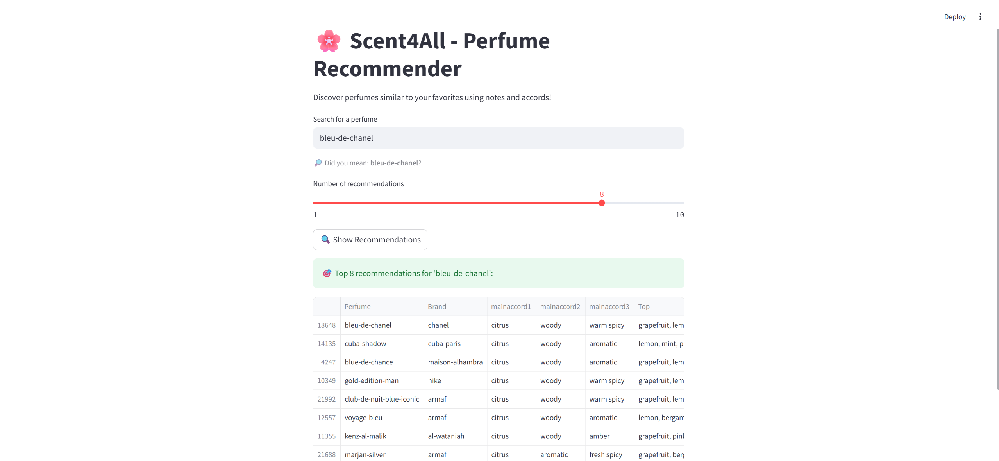

# Scent4All

## 🌸 Overview



**Scent4All** is an open-source Python project that recommends perfumes based on olfactory similarity using scent notes and main accords. The app features a simple Streamlit interface and leverages cosine similarity between perfumes described in a structured dataset.

## 🎯 Highlights

| 💡 Feature                    | 📌 Description                                                      |
| ---------------------------- | ------------------------------------------------------------------- |
| 🔍 **Fuzzy Search**           | Find perfumes even with typos or partial names                      |
| 🌿 **Note-Based Features**    | Uses top, middle, base notes + main accords to describe each scent  |
| 🧠 **TF-IDF Vectorization**   | Extracts features from scent descriptions using text vectorization  |
| 🤝 **Cosine Similarity**      | Computes closeness between perfumes for ranking recommendations     |
| 🖥️ **Streamlit UI**           | Interactive web interface to explore similar perfumes                |

## ⚙️ Workflow Overview

1. **Load Dataset**: Import perfumes dataset (`.csv`) with scent data.
2. **Feature Construction**: Merge main accords and notes into a single text string per perfume.
3. **TF-IDF Vectorization**: Transform scent descriptions into numerical vectors.
4. **Similarity Computation**: Calculate cosine similarity matrix between perfumes.
5. **Query Matching**: Match input perfume name with fuzzy search.
6. **Recommendation Output**: Display top N similar perfumes via Streamlit.

## 📁 Project Structure

```
Scent4All/
├── app/                         # Source code
│   ├── app.py                   # Streamlit UI logic
├── src/                         # Source code                 
│   ├── recommender.py           # End-to-end recommendation pipeline
│   ├── features.py              # Feature extraction using TF-IDF
│   ├── similarities.py          # Cosine similarity computation
│   ├── data_loader.py           # CSV reader
│   ├── utils.py                 # Clustering helpers
│   └── constants.py             # Global constants
├── data/
│   └── perfumes_dataset.csv     # Cleaned dataset (Fragrantica-based)
├── assets/
│   └── main_img.png             # Visuals
├── requirements.txt             # Python dependencies
├── .gitignore
├── README.md
└── LICENSE
```

## 🌟 License

This project is open-source. Feel free to use, modify, and contribute! 🚀
